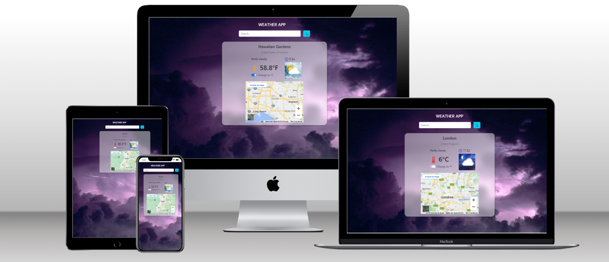

# Kruger Star Weather App

> Weather App using UseEffect Hook.

## Built with 

- HTML + CSS
- JavaScript
- React.JS v18
- React Bootstrap
- React Icons
- WeatherApi

## Live Demo

[Live demo link](https://krugerstar-weather-dc.netlify.app/)

## Run it locally

 ### Setup

 - Clone this repo using `git clone https://github.com/DaniCis/WeatherApp_Kruger`

 ### Commands

 - `npm i`
 - `npm start`

## Author

👤 **Daniela Cisneros**

- GitHub: [@DaniCis](https://github.com/DaniCis)
- Twitter: [@DaniCisneros99](https://twitter.com/DaniCisneros99)

## 🤝 Contributing

- Juan Sotomayor - Tutor Kruger Star

## Show your support

Give a ⭐ if you like this project!